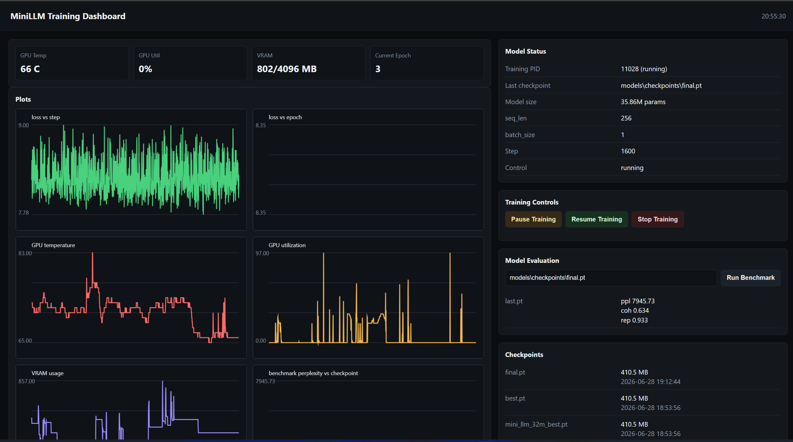

# MiniLLM — From-Scratch Local Language Model




MiniLLM is a compact decoder-only language model built from scratch with PyTorch. The repository covers the complete pipeline: dataset preparation, byte-level BPE tokenization, training, validation, checkpointing, evaluation, quantization experiments, and local inference.

The project is designed for learning and experimentation on consumer hardware. Its goal is to make the main components of a language model understandable and inspectable, rather than to compete with production pretrained LLMs.


## Features

- Approximately 36M-parameter decoder-only Transformer.
- Byte-level BPE tokenizer with Italian, punctuation, UTF-8, and code support.
- Dataset builder for natural text and small synthetic QA, dialogue, instruction-tuning, and technical examples.
- Leakage-resistant train/validation split created before sliding token windows.
- Token cache validation based on the tokenizer, source files, and preprocessing settings.
- Laptop-safe training with mixed precision, gradient checkpointing, dynamic memory fallbacks, checkpoint resume, and temperature cooldown.
- Local FastAPI dashboard with loss charts, GPU temperature, utilization, VRAM, logs, checkpoints, and benchmark plots.
- Benchmark Suite with perplexity, average log-likelihood, token accuracy, coherence, and repetition metrics.
- Chat Mode with streaming responses, checkpoint selector, history, and professional fallback guardrails.
- Portable int8/int4 checkpoint-compression experiments.
- Automated tests for tokenizer round-trips, causal masking, tied embeddings, dataset isolation, generation, and end-to-end execution.
- GitHub Actions test workflow using PyTorch CPU.

## Architecture

The model follows a small GPT-style design:

- learned token and positional embeddings;
- pre-normalized Transformer blocks;
- causal multi-head self-attention;
- GELU feed-forward networks;
- residual connections and dropout;
- tied input embeddings and language-model output weights;
- configurable context length and gradient checkpointing.

The default preset uses a vocabulary of 8,192 tokens, 12 Transformer layers,
8 attention heads, a hidden size of 512, and a feed-forward size of 1,536. This
corresponds to approximately 36M parameters. The CLI identifier
`mini_llm_32m` is retained for backward compatibility.

## Data and validation

The included builder creates a compact educational corpus containing natural text
and synthetic examples for QA, dialogue, instruction following, and technical
language. Synthetic sources are intentionally described as dataset-inspired and
are not presented as copies of the official Wikipedia, Gutenberg, SQuAD, or
OpenAssistant datasets.

The token stream is divided into contiguous training and validation regions before
sliding windows are generated. A context-length gap separates the regions so that
overlapping sequences cannot appear in both sets. This makes validation loss more
representative than a random split performed after window creation.

Processed tokens are cached together with a fingerprint derived from the tokenizer,
source files, and preprocessing options. The cache is rebuilt automatically when
any of these inputs changes.

## Scope and limitations

MiniLLM is a from-scratch educational model, not an attempt to compete with
pretrained production LLMs. The default corpus is deliberately small and contains
synthetic, template-generated examples inspired by QA and assistant datasets; it
does not bundle the official Wikipedia, Gutenberg, SQuAD, or OpenAssistant
datasets. The project is intended to demonstrate the complete language-model
pipeline on consumer hardware.

The int8/int4 utilities compress checkpoints, then dequantize weights when loading
the standard PyTorch model. They reduce file size but do not provide true int8/NF4
inference kernels or guaranteed speed/VRAM improvements.

The default dataset and compute budget are intentionally modest. MiniLLM can learn
local patterns and produce short domain-related sequences, but it is not expected
to provide the knowledge, robustness, or generalization of a pretrained assistant.

## Quick Start

```bash
git clone https://github.com/RenzoAlbertini/mini_llm.git
cd mini_llm
python -m pip install -r requirements.txt
```

Build dataset and tokenizer:

```bash
python data/raw/build_dataset.py --force
python tokenizer/build_tokenizer.py --dataset data/processed/train.txt --out tokenizer/tokenizer.json --vocab_size 8192
```

Start laptop-safe training:

```bash
python run_training.py --model_size mini_llm_32m --seq_len 256 --batch_size 1 --epochs 8 --gradient_checkpointing --fp16 --gpu_memory_fraction 0.70 --gpu_max_temp 80 --thermal_cooldown_seconds 10 --eval_every 200 --eval_batches 5 --checkpoint_dir models/checkpoints
```

Training writes:

```text
models/checkpoints/best.pt
models/checkpoints/last.pt
models/checkpoints/final.pt
data/logs/training.log
data/logs/training_stats.csv
```

## Dashboard

```bash
python dashboard.py --port 8010
```

Open `http://127.0.0.1:8010`.

The dashboard monitors training in real time and includes plots, GPU stats, checkpoint status, benchmark results, and training controls.

## Chat Mode

```bash
python chat/server.py --checkpoint models/checkpoints/best.pt --port 8020
```

Open `http://127.0.0.1:8020/chat`.

API endpoints:

```http
POST /api/chat
GET /api/chat/checkpoints
```

Example:

```bash
curl -X POST http://127.0.0.1:8020/api/chat -H "Content-Type: application/json" -d "{\"prompt\":\"Ciao, come ti chiami?\",\"temperature\":0.45,\"top_p\":0.82,\"max_tokens\":80,\"history\":[]}"
```

## Benchmark

```bash
python evaluate.py --checkpoint models/checkpoints/best.pt
```

Results are saved in `data/benchmarks/results_<checkpoint>.json`.

The benchmark reports language-model and generation-oriented metrics. Results
should be interpreted as comparisons between MiniLLM checkpoints, not as direct
comparisons with large instruction-tuned production models.

Dashboard API:

```http
POST /api/evaluate
Content-Type: application/json

{"checkpoint_path":"models/checkpoints/best.pt"}
```

## Project Layout

```text
model/       transformer architecture and configs
training/    trainer, dataset loader, checkpoints, controls
tokenizer/   BPE tokenizer build and artifacts
data/        raw builders, processed dataset, logs, plots
chat/        local Chat Mode API and UI
benchmark/   evaluation dataset and metrics
ui/          local UI assets
utils/       helpers, quantization, plotting
tests/       test suite
export/      export artifacts
```

## Tests

Run the complete test suite with:

```bash
python run_all_tests.py
```

The suite checks:

- tokenizer UTF-8 round-trip and serialization;
- model forward pass and output shapes;
- causal masking against future-token leakage;
- tied token-embedding and output weights;
- isolation between training and validation windows;
- token-cache invalidation after source changes;
- autoregressive generation;
- a lightweight end-to-end model path.

The same suite runs automatically on GitHub Actions for pushes and pull requests.

## Release

Current release: `v1.0.0`

Roadmap:

- More diverse and deduplicated training data.
- Document-level dataset splitting for multi-document corpora.
- LoRA experimentation with a small pretrained baseline.
- More benchmark categories.
- Model card and dataset card.
- ONNX or TorchScript export.

## License

MIT License. See [LICENSE](LICENSE).
